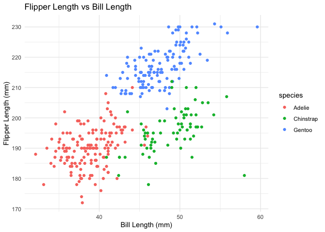

P8105_HW1_JG4890
================
2024-09-21

## Question 1

## Import Data

``` r
data("penguins", package = "palmerpenguins")
library(dplyr)
```

    ## 
    ## Attaching package: 'dplyr'

    ## The following objects are masked from 'package:stats':
    ## 
    ##     filter, lag

    ## The following objects are masked from 'package:base':
    ## 
    ##     intersect, setdiff, setequal, union

``` r
library(ggplot2)
```

## Data set description

``` r
n_rows <- nrow(penguins)
n_cols <- ncol(penguins)
mean_flipper_length <- mean(penguins$flipper_length_mm, na.rm = TRUE)
```

This dataset has 8 cols and 344 rows in total.The columns contains 8
different variables which are species, island, bill length, bill depth,
flipper length, body mass, sex and year. The mean flipper length is
200.92 mm.

## Scatterplot

``` r
ggplot(penguins, aes(x = bill_length_mm, y = flipper_length_mm, color = species)) +
  geom_point() +
  labs(title = "Flipper Length vs Bill Length", x = "Bill Length (mm)", y = "Flipper Length (mm)") +
  theme_minimal()
```

    ## Warning: Removed 2 rows containing missing values or values outside the scale range
    ## (`geom_point()`).

<!-- -->

``` r
ggsave("scatterplot_penguins.png")
```

    ## Saving 7 x 5 in image

    ## Warning: Removed 2 rows containing missing values or values outside the scale range
    ## (`geom_point()`).

The scatter plot visualizes the relationship between flipper
length(Y-axis) and bill length(X-axis) for different penguin species,
with all three species represented in different colors. The graph shows
clear differences in these measurements across species. There was some
missing information when the scatterplot was saved, so 2 rows with
missing values were removed from the dataset before drawing. This
ensures that only the complete data points are displayed in the scatter
plot.

\##Question 2

## Create a data frame

``` r
library(tidyverse)
```

    ## ── Attaching core tidyverse packages ──────────────────────── tidyverse 2.0.0 ──
    ## ✔ forcats   1.0.0     ✔ stringr   1.5.1
    ## ✔ lubridate 1.9.3     ✔ tibble    3.2.1
    ## ✔ purrr     1.0.2     ✔ tidyr     1.3.1
    ## ✔ readr     2.1.5     
    ## ── Conflicts ────────────────────────────────────────── tidyverse_conflicts() ──
    ## ✖ dplyr::filter() masks stats::filter()
    ## ✖ dplyr::lag()    masks stats::lag()
    ## ℹ Use the conflicted package (<http://conflicted.r-lib.org/>) to force all conflicts to become errors

``` r
set.seed(1)
sample_normal <- rnorm(10)
logical_vector <- sample_normal > 0
character_vector <- LETTERS[1:10]
factor_vector <- factor(sample(c("Low", "Medium", "High"), 10, replace = TRUE))

df <- data.frame(
  normal_sample = sample_normal,
  logical_greater_than_0 = logical_vector,
  character = character_vector,
  factor = factor_vector
)
print(df)
```

    ##    normal_sample logical_greater_than_0 character factor
    ## 1     -0.6264538                  FALSE         A    Low
    ## 2      0.1836433                   TRUE         B   High
    ## 3     -0.8356286                  FALSE         C    Low
    ## 4      1.5952808                   TRUE         D    Low
    ## 5      0.3295078                   TRUE         E    Low
    ## 6     -0.8204684                  FALSE         F    Low
    ## 7      0.4874291                   TRUE         G Medium
    ## 8      0.7383247                   TRUE         H    Low
    ## 9      0.5757814                   TRUE         I    Low
    ## 10    -0.3053884                  FALSE         J Medium

## Calculate the means

``` r
mean_normal <- mean(pull(df, normal_sample))
mean_logical <- mean(pull(df, logical_greater_than_0))
mean_character <- mean(pull(df, character))  
```

    ## Warning in mean.default(pull(df, character)): argument is not numeric or
    ## logical: returning NA

``` r
mean_factor <- mean(pull(df, factor))        
```

    ## Warning in mean.default(pull(df, factor)): argument is not numeric or logical:
    ## returning NA

Mean of normal_sample works because it’s numeric.

Mean of logical_greater_than_0 works because logical values are coerced
to numeric (TRUE becomes 1 and FALSE becomes 0).

Mean of character produces an error because character data cannot be
coerced to numeric directly.

Mean of factor also produces an error because factors must be converted
to numeric properly (they represent levels, not direct values).

## Convert variables

``` r
numeric_logical <- as.numeric(df$logical_greater_than_zero)
numeric_character <- as.numeric(df$character)  
```

    ## Warning: NAs introduced by coercion

``` r
numeric_factor <- as.numeric(df$factor)     

#print(numeric_logical)
#print(numeric_character)
#print(numeric_factor)
```

Logical to Numeric: Converts TRUE to 1 and FALSE to 0.

Character to Numeric: Produces NA for all values since character strings
cannot be converted to numbers.

Factor to Numeric: Converts to the underlying integer codes for the
factor levels (not the actual levels itself).

Converting variables reveals how R interprets and handles different data
types during calculations, so it helps explain what happens when you try
to take the mean.
